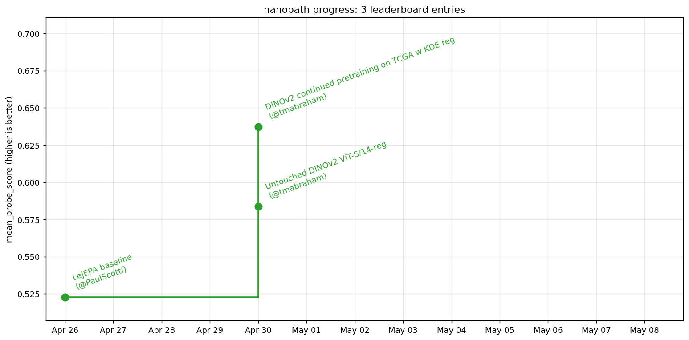

# nanopath


`nanopath` is a super lean experimental harness for training tile-level computational pathology foundation models, inspired by [nanochat](https://github.com/karpathy/nanochat). It runs on a single GPU, the code is minimal/hackable, and covers the full pretraining pipeline using the public TCGA dataset (12k WSIs) and built-in probe evals from the [Thunder benchmark](https://mics-lab.github.io/thunder/).

This repository is intentionally made to be compatible with [autoresearch](https://github.com/karpathy/autoresearch)-style pursuits. We will continuously update our codebase and [Leaderboard](#leaderboard) to reflect the best performing model. The current leaderboard winner (`configs/leader.yaml`) takes ~1 hour on one H100 GPU (this includes the six downstream probes evaluated at the end of the same job).

**Want to get involved? Join us in the [MedARC Discord](https://discord.gg/tVR4TWnRM9) (find us in #path-fm)!**

## Quickstart

Install [uv](https://docs.astral.sh/uv/) first if you don't have it, then:

```bash
git clone https://github.com/MedARC-AI/nanopath.git && cd nanopath
uv sync && source .venv/bin/activate
wandb login

# first-time setup to verify pretrain + probe + DINOv2-weights are present
python prepare.py configs/smoke.yaml download=False

# "smoke test": train + eval model in <10 min to check everything works
sbatch submit/train_1gpu.sbatch configs/smoke.yaml
# or directly: python train.py configs/smoke.yaml

# train and evaluate current first place model in the leaderboard
sbatch submit/train_1gpu.sbatch configs/leader.yaml
# or directly: python train.py configs/leader.yaml
```

If you are a MedARC volunteer on our shared cluster, the checked-in configs already point at `/data/nanopath_parquet` for the tile shards and `/block/{eva-data,thunder-data}/<name>` for the probe datasets.

For non-MedARC cluster users, run `python prepare.py configs/leader.yaml download=True` to automatically download our 4M-tile dataset (200 parquet shards, ~120 GB) from our [nanopath HF dataset](https://huggingface.co/datasets/medarc/nanopath), pull each probe dataset from its public source, and fetch relevant pretrained weights for the configured `model.type`. That is the entire data setup; you do not need the original TCGA SVS files to train.

`pyproject.toml` pins `torch` / `torchvision` against the CUDA 12.9 wheel index. If your GPU/driver needs a different CUDA build (e.g. cu118 for older A100/V100 setups), edit the `torch` and `torchvision` lines in `pyproject.toml` before `uv sync`.

A successful model training prints periodic train lines, logs to wandb, and ends with a final summary in `metrics.jsonl`. `configs/smoke.yaml` is simply meant to train/eval a quick <10-minute run to check everything works; use `configs/leader.yaml` for full runs.

## Leaderboard



Score is final `mean_probe_score`: unweighted mean of standard classification probe F1 aggregates (bach, bracs, break_his, mhist, pcam) and pannuke segmentation Jaccard. All metrics are computed on each dataset's validation split only; train splits solely fit the probe heads on top of the frozen backbone.

| # | mean | linear | KNN | few-shot | seg Jaccard | Description | wandb | Date | Contributors |
|---|------:|-------:|----:|---------:|------------:|-------------|-------|------|--------------|
| 1 | **0.6280** | 0.7964 | 0.7084 | 0.6031 | 0.4039 | DINOv2 ViT-S/14-reg continual pretraining (DINO CLS + iBOT + KDE on TCGA tiles) | [iewrzghc](https://wandb.ai/paulscotti/nanopath/runs/iewrzghc) | May 1 2026 | @tmabraham, @PaulScotti |
| 2 | 0.5838 | 0.7472 | 0.6614 | 0.6110 | 0.3155 | Untouched Meta `dinov2_vits14_reg` (no continual pretraining on TCGA) | [6r1cmaee](https://wandb.ai/paulscotti/nanopath/runs/6r1cmaee) | Apr 30 2026 | @tmabraham |
| 3 | 0.5228 | 0.6832 | 0.6093 | 0.4490 | 0.3496 | LeJEPA baseline | [t72j3r8k](https://wandb.ai/paulscotti/nanopath/runs/t72j3r8k) | Apr 26 2026 | @PaulScotti |

### How to submit to the leaderboard

The current `configs/leader.yaml` is the top performing leaderboard recipe. To get on the leaderboard you must outperform the existing top leaderboard `mean_probe_score` by at least 0.01. If you do so, open a PR to this repo with a description of your changes (please keep only the minimal necessary code changes that improve performance) and share your wandb run/report. [@PaulScotti](https://github.com/PaulScotti) will train a new model using your code on his 1 80GB H100, using a different rng seed and striving to reduce the submission to the smallest practical diff against the current codebase. If it still improves `mean_probe_score` by at least 0.01, we will update the README & leaderboard accordingly. **You don't need an H100 yourself to submit** — train on whatever hardware you have access to, share the run if you think it's a winner, and Paul handles H100 verification.

We also strongly welcome PRs that simplify the codebase — either by reducing lines of code (excluding commented-out lines intended for readability) or by reducing complexity (e.g. replacing the cosine LR scheduler with a constant LR) — without regressing `mean_probe_score`.

### What you must NOT change for a leaderboard submission

Anything not explicitly fixed below (e.g., model architecture, training objective, optimizer, lr scheduler, data augmentations, masking, dataset curation) is fair game for modification.

**Training ends at 1e18 total FLOPs OR after 45 min. elapsed on 1xH100**

Every leaderboard run is verified on the organizer's compute (1 80GB H100 gpu), bounded by two possible caps:

- **`train.max_train_flops` ≤ 1e18 training FLOPs**, measured directly from aten op shapes via `torch.utils.flop_counter.FlopCounterMode` on the first step (forward + backward + opt.step) and reused thereafter since per-step shapes are fixed. This counts everything that touches the GPU during a step — student backbone, EMA teacher forward, projection heads, masking, etc. — not just the backbone.
- **≤45 min. end-to-end on a single 80 GB H100**, enforced by SLURM. `submit/train_1gpu.sbatch` runs with `--signal=USR1@900`, so SLURM sends `SIGUSR1` 15 minutes before the `--time` wall; `train.py`'s SIGUSR1 handler catches it as a clean stop signal, cuts training, and uses the remaining ~15 minutes for the final checkpoint save + the six probe head fits + downstream eval. With `--time=01:00:00`, that's ≈45 min effective training + 15 min for probes = 1 h total.

The above limits force submissions to be **simultaneously compute efficient and systems efficient**.

**TCGA as the only pretraining data**
- TCGA (12K WSIs) is the only dataset allowed for pretraining, but you are free to revise how we select the tiles used for training.
- The probe datasets cannot be used for pretraining, neither directly (training data) nor indirectly (distillation target, contrastive negatives, label-smoothing prior, etc.).

**Probe evaluation must be untouched**
- All of `probe.py`.
- `probe_data_splits/` — the checked-in classification splits.
- All probe config variables in `configs/leader.yaml`.

**Initializing model from a pretrained ckpt is OK only if not pathology-specific**
You can initialize the model using DINOv2 checkpoint (trained on natural images) but you can't initialize from, say, H-optimus or OpenMidnight checkpoints. We want to train a pathology foundation model so we shouldn't offload most of the training to someone else's pathology-specific model.

## Repository layout

### Primary files meant to be hacked
- `train.py` — main pretraining loop
- `model.py` — model architecture and training objectives
- `dataloader.py` — TCGA tile loader and data augmentations
- `configs/{smoke,leader}.yaml` — training recipes (e.g., hyperparameters)

### Helper files
- `AGENTS.md` — guidelines for AI assistants and human contributors: design philosophy (minimal/hackable, nanochat-flavored), coding rules, experiment discipline, and cluster/storage conventions. Note some language is specific to the MedARC cluster.
- `prepare.py` — data prep: verify or download HF tile mirror + probe datasets + any pretrained weights.
- `probe.py` — downstream probes (KNN, few-shot, linear, segmentation).
- `submit/train_1gpu.sbatch` — SLURM launcher for single-GPU training.
- `probe_data_splits/` — checked-in classification splits for probes.
- `download_TCGA.sh` — manual utility, run by hand if you want the full 12K TCGA open-access SVS slide set (~13 TB) for forking the tile-extraction recipe. Not invoked by `prepare.py` and not needed for any standard training workflow.
- `LOG.md` — running notes on what has been tried, including negative results.
- `pyproject.toml` + `uv.lock` — Python dependency spec consumed by `uv sync`.

## Data

`prepare.py` prepares the necessary data for pretraining. Flag `download=True` to download all datasets to the folders specified by the .yaml, or flag `download=False` to simply verify if all datasets are already present.

Edit `data.dataset_dir` and every `probe.dataset_roots.*` in your config (`configs/leader.yaml` and `configs/smoke.yaml` if you also smoke-test) to your own correct paths.

```bash
# Pull the 4M-tile parquet dataset from the medarc/nanopath HF mirror into
# data.dataset_dir, pull each missing probe dataset from its public source
# into the configured probe.dataset_roots paths, and fetch pretrained models
python prepare.py configs/leader.yaml download=True

# Verify-only: confirms the parquet shards, every probe dataset listed in
# the config, and any necessary pretrained weights all exist on disk where
# train.py expects them.
python prepare.py configs/leader.yaml download=False
```

**What `download=True` does**
1. **TCGA tiles**: `huggingface_hub.snapshot_download` (filtered to `shard-*.parquet`) pulls the 200 parquet shards (~120 GB total, `{path: string, jpeg: binary}` rows with 64-row row groups) from [`medarc/nanopath`](https://huggingface.co/datasets/medarc/nanopath) into `data.dataset_dir`.
2. **Probe datasets** (bach / bracs / break_his / mhist / pcam / pannuke): for each empty root, fetches + unpacks the dataset from its public source into the configured path.
3. **DINOv2 backbone weights**: `torch.hub.load_state_dict_from_url` fetches the Meta checkpoint for `model.type` from `dl.fbaipublicfiles.com` into `~/.cache/torch/hub/checkpoints/`.

**Prerequisites**
- ~120 GB free wherever `data.dataset_dir` lives for the parquet shards (cluster default: `/data/nanopath_parquet`).
- ~30 GB free in total across the six `probe.dataset_roots` entries (pannuke ~13 GB + bach ~10 GB are the bulk; the rest are smaller).
- ~330 MB free under `~/.cache/torch/hub/checkpoints/` for DINOv2 weights.
- mhist requires a one-time form at https://bmirds.github.io/MHIST/. Drop the resulting `annotations.csv` + `images.zip` into `probe.dataset_roots.mhist`, then rerun `prepare.py … download=True` to unpack.

### Regenerating the tile dataset from raw SVS

`prepare.py` itself never touches raw SVS files — it always pulls the ready-made parquet shards from HF. If you want, however, you can download the full ~13 TB original SVS files from TCGA and pre-extract different tiles to pretrain on. Two-step workflow (decode SVS → JPEG dir + manifest, then pack into parquet shards):

```bash
# 1) Download the full 12K open-access TCGA SVS slide set (~13 TB).
bash download_TCGA.sh /data/TCGA 8

# 2) Decode + pack. prepare_tiles deterministically subsamples the sample list
#    to TARGET_TILE_COUNT (4M, hardcoded in prepare.py — bump it for a bigger
#    dataset) and writes JPEGs + manifest.txt under jpeg_dir; reruns are
#    resumable (existing JPEGs are EOF-validated and reused). pack_from_jpeg_dir
#    then walks the manifest, splits into NUM_SHARDS=200 chunks, and writes
#    shard-NNNNN.parquet files with 64-row row groups (the layout the
#    dataloader expects). Once it's done you can rm -rf the jpeg_dir.
python -c "
from pathlib import Path
from prepare import prepare_tiles, pack_from_jpeg_dir
jpeg_dir = Path('/data/nanopath_jpegs_tmp')
prepare_tiles(Path('/data/TCGA/sample_dataset_30.txt'), jpeg_dir, split_seed=42)
pack_from_jpeg_dir(jpeg_dir, jpeg_dir / 'manifest.txt', Path('/data/nanopath_parquet'))
"
```

To publish a new variant of the dataset, push the resulting shards to a fresh HF dataset repo and update `HF_REPO_ID` in `prepare.py`.

## Running

Smoke (single GPU, ~5 min training + ~4 min probe, validates the full train+probe path):

```bash
sbatch submit/train_1gpu.sbatch configs/smoke.yaml
# or directly: `python train.py configs/smoke.yaml`
```

Leader (full train+probe for the first place recipe in our Leaderboard)

```bash
sbatch submit/train_1gpu.sbatch configs/leader.yaml
# or directly: `python train.py configs/leader.yaml`
```

`configs/leader.yaml` is sized for an 80 GB H100 at `train.batch_size: 128`. On smaller cards you can set `train.activation_checkpointing: true` if you OOM. Smoke fits comfortably on any 24 GB+ GPU.

## Outputs

- run outputs: `project.output_dir` (default is `/data/$USER/nanopath/leader/...`). Final probe results log to `metrics.jsonl`.
- wandb: `/data/$USER/nanopath/wandb`.
- parquet tile shards: `data.dataset_dir` (defaults to `/data/nanopath_parquet`).
- probe datasets: `probe.dataset_roots` (defaults to `/block/{eva-data,thunder-data}/<name>`).
- DINOv2 backbone weights: `~/.cache/torch/hub/checkpoints/` for the selected `model.type`.
- SLURM logs: `slurm/<jobid>.{out,err}` in the repo.
- checkpoints: rolling `latest.pt` written every `train.save_every` steps under `project.output_dir`, plus one final save at end of run. `save_every: null` (smoke) disables both; probes always get their own short-lived checkpoint regardless.

## Experiment log

See [LOG.md](LOG.md) for running notes on what has been tried in nanopath. Negative results included! Such logs help contributors avoid retrying dead ends.

## Acknowledgements

Inspired by [nanochat](https://github.com/karpathy/nanochat). The DINOv2 backbone weights are [Meta checkpoints](https://github.com/facebookresearch/dinov2) loaded by state-dict into our own clean ViT implementation. Probe code is adapted from the [Thunder benchmark](https://mics-lab.github.io/thunder/).
