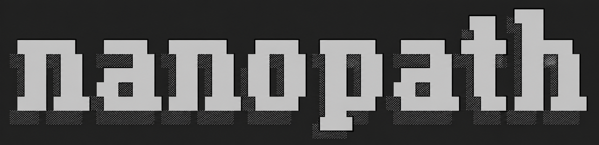

# nanopath



`nanopath` is a simple experimental harness for training tile-level computational pathology foundation models, inspired by [nanochat](https://github.com/karpathy/nanochat). It is designed to run on a single GPU (but can also be run with multi-gpu if you want faster, identical results), the code is minimal/hackable, and covers the full pretraining-from-scratch pipeline using the public TCGA dataset (12k WSIs) and built-in probe evals from the [Thunder benchmark](https://mics-lab.github.io/thunder/).

The current leaderboard winner uses a LeJEPA-style training objective: pull the projector outputs of all global and local crops of an image toward their per-sample mean (multi-view consistency), regularized by SIGReg to prevent representational collapse. An EMA copy of the backbone is maintained alongside training and used only as the weights the downstream probes read from. The reference recipe (`configs/leader.yaml`) takes ~4 h on one H100 or ~1.25 h on 4×H100 (this includes the six probes evaluated in the same job).

**Want to get involved? Join us in the [MedARC Discord](https://discord.gg/tVR4TWnRM9) (find us in #path-fm)!**

## Quickstart

Install [uv](https://docs.astral.sh/uv/) first if you don't have it, then:

```bash
git clone https://github.com/MedARC-AI/nanopath.git && cd nanopath
uv sync && source .venv/bin/activate
wandb login
sbatch submit/train_1gpu.sbatch configs/smoke.yaml
# or directly: python train.py configs/smoke.yaml
```

If you are a MedARC volunteer using our shared cluster, the above steps should work as-is. If you are using your own compute, you'll also need to download the TCGA pretraining data and the downstream probe datasets. See Data section of this README for instructions.

`pyproject.toml` pins `torch` / `torchvision` against the CUDA 12.9 wheel index. If your GPU/driver needs a different CUDA build (e.g. cu118 for older A100/V100 setups), edit the `torch` and `torchvision` lines in `pyproject.toml` before `uv sync`.

A successful smoke prints periodic train/val lines, logs to wandb, and ends with final summary in `metrics.jsonl`. Probe scores will be near-random since smoke is undertrained; the goal is just to confirm everything wires up. The full `configs/leader.yaml` should land near the leaderboard's ~0.52 `mean_probe_score`; for context, a randomly initialized backbone scores roughly ~0.2.

## Leaderboard

Score is final `mean_probe_score`: unweighted mean of standard classification probe F1 aggregates (bach, bracs, break_his, mhist, pcam) and pannuke segmentation Jaccard. All metrics are computed on each dataset's validation split only; train splits solely fit the probe heads on top of the frozen backbone.

| # | mean | linear | KNN | few-shot | seg Jaccard | Description | wandb | Date | Contributors |
|---|------:|-------:|----:|---------:|------------:|-------------|-------|------|--------------|
| 1 | **0.5228** | 0.6832 | 0.6093 | 0.4490 | 0.3496 | LeJEPA baseline | [t72j3r8k](https://wandb.ai/paulscotti/nanopath/runs/t72j3r8k) | Apr 26 2026 | @PaulScotti |

### How to submit to leaderboard

The checked-in `configs/leader.yaml` is the top performing leaderboard recipe. To get on the leaderboard you must run that config end-to-end and outperform the existing top leaderboard `mean_probe_score` by at least 0.01. If you do so, contact [@PaulScotti](https://github.com/PaulScotti) and share your code with him; he will train a new model using your code but with a different rng seed. If it still improves `mean_probe_score` by at least 0.01, you should open a PR to this repo (please keep only the minimal necessary code changes that improve performance) and a description of your changes. Paul will update the README & leaderboard accordingly.

### What you must NOT change for a leaderboard submission

To keep entries comparable, the following are fixed across all submissions. Anything else (model architecture, training objective, optimizer, schedule shape, augmentation policy, EMA decay, masking, predictor design, dataset curation, etc.) is fair game.

**Compute budget**
- `train.max_train_flops` (1e18). Compute budget is fixed to facilitate direct comparisons across training approaches; you can't buy higher score with more compute.

**Activated parameter count**
- **≤150M activated backbone params**, where "backbone" is everything in `NanoPathFM` except `self.projector` (the projector is pretraining-only scaffolding and is discarded for downstream probes).
- For MoE / sparse architecture explorations, count parameters touched on a single token's forward pass.
- `train.py` already computes `backbone_activated_params` for easy verification.

**TCGA pretraining**
- TCGA (12K WSIs) is the only dataset allowed for pretraining, but you are free to revise how we select the tiles used for training.

**Probe evaluation**
- All of `probe.py`.
- `seg_head.py` — the pannuke `MaskTransformer` head and `multiclass_dice_loss`.
- `probe_data_splits/` — the checked-in classification splits.
- All probe config variables in `configs/leader.yaml`. Probes should run on EMA weights.

## Repository layout

### Primary files meant to be hacked
- `train.py` — the main pretraining loop (DDP via torchrun, JEPA + SIGReg, EMA, probe dispatch, wandb logging).
- `model.py` — `NanoPathFM` ViT backbone. Hack here for new model architectures / training objectives.
- `dataloader.py` — TCGA sample-list streaming loader and augmentation stack. Hack here for crop/color/HED augmentation, preprocessing, or data curation changes.
- `configs/{smoke,leader}.yaml` — recipes (model shape, optimizer, schedule, augmentation knobs, probe config).

### Helper files
- `AGENTS.md` — guidelines for AI assistants and human contributors: design philosophy (minimal/hackable, nanochat-flavored), coding rules, experiment discipline, and cluster/storage conventions. Note some language is specific to the MedARC cluster.
- `probe.py` — downstream probes (KNN, few shot, linear, segmentation).
- `submit/train_{1,4}gpu.sbatch` — SLURM launchers.
- `seg_head.py` — `MaskTransformer` + `multiclass_dice_loss` (used by `probe.py`'s pannuke segmentation), vendored by Thunder.
- `download_probe_datasets.py` — auto-downloads the six probe datasets if missing.
- `download_TCGA.sh` — downloads TCGA SVS pretraining slides plus `sample_dataset_30.txt` (specifies the specific tiles to load).
- `probe_data_splits/` — checked-in classification splits for probes.
- `pyproject.toml` + `uv.lock` — Python dependency spec consumed by `uv sync` in Quickstart.

## Data

**To download the datasets you'll need:**
- A HuggingFace login (`huggingface-cli login` or `HF_TOKEN`) — the TCGA SVS mirror is gated.
- Kaggle credentials in `~/.kaggle/kaggle.json` — required to download `break_his`.
- mhist form access — the script prints the form URL the first time it runs and waits for the resulting download.
- ~13 TB free disk for TCGA SVS files plus ~30 GB for the six probe datasets. *(TODO: provide alternative that requires less disk space.)*

- **TCGA pretraining data**: checked-in configs default to
  `/block/TCGA/sample_dataset_30.txt`, which is the shared cluster path used by [MedARC](https://www.medarc.ai/). External users should download their own copy:

  ```bash
  # Requires large storage: the open TCGA SVS slide set is multi-TB.
  # If the Hugging Face repo is gated, set HF_TOKEN or run huggingface-cli login first.
  bash download_TCGA.sh /data/TCGA 8
  ```

  This writes `/data/TCGA/sample_dataset_30.txt`, downloads open-access TCGA SVS files from GDC, and creates flat `/data/TCGA/*.svs` symlinks for the sample list. To use it, copy a config and set:

  ```yaml
  data:
    sample_list: /data/TCGA/sample_dataset_30.txt
  ```

  `train.py` errors before training if the configured sample list is missing, and the dataloader errors with the same setup guidance if a listed SVS file is missing.
- **Probe datasets** (bach / bracs / break_his / mhist / pcam / pannuke):
  `python download_probe_datasets.py configs/leader.yaml` pulls each one to the path given in `probe.dataset_roots` if not already present. Off-cluster, edit `probe.dataset_roots` in the config to point at writable directories before running. mhist requires a one-time form access (the script prints instructions); break_his requires Kaggle credentials in `~/.kaggle/kaggle.json`.

## Running

Smoke (single GPU, ~8 min, validates the full train+probe path):

```bash
sbatch submit/train_1gpu.sbatch configs/smoke.yaml
# or directly: `python train.py configs/smoke.yaml`
```

Leader recipe (1 H100 gpu = ~4h; 4 H100 gpus = ~1.25h)

```bash
sbatch submit/train_1gpu.sbatch configs/leader.yaml
# or directly: `python train.py configs/leader.yaml`
# can alternatively do `submit/train_4gpu.sbatch` for faster training
```

`configs/leader.yaml` is sized for an 80 GB H100 at `train.global_batch_size: 128`. On smaller cards you can set `train.activation_checkpointing: true` if you OOM. Smoke fits comfortably on any 24 GB+ GPU.

## Outputs

- run outputs: `project.output_dir` (checked-in configs default under `${NANOPATH_DATA_DIR}/leader/...`; wiped on fresh launch).
- wandb: `${NANOPATH_DATA_DIR}/wandb`.
- sample-list cache: `${NANOPATH_DATA_DIR}/cache`.
- SLURM logs: `${NANOPATH_DATA_DIR}/slurm/<jobid>.{out,err}`.

The sbatch launchers create `NANOPATH_DATA_DIR`, which defaults to `/data/$USER/nanopath`.

Recipes with `train.save_every` set write a rolling `latest.pt`; smoke sets `train.save_every: null`, so it leaves no persistent checkpoints. Probes run inline in the same job using EMA weights with training paused while they run, logged into wandb + `metrics.jsonl`.


# Experiment log

Running notes on what has been tried in nanopath, with links to wandb where possible. Append new entries at the top. Negative results are valuable — record them so the next contributor doesn't redo a known dead end.

- 2026-04-26 — **EMA vs. Non-EMA**: probing the raw model weights instead of EMA shows no difference in performance. I prefer we default to EMA since we know with OpenMidnight that averaging across checkpoints improves results, and EMA is kind of like averaging across checkpoints. Also EMA is known to generally enhance robustness. (@PaulScotti)
- _add yours here_

# Acknowledgements

Inspired by [nanochat](https://github.com/karpathy/nanochat). Probe code, dataset splits, and the pannuke `MaskTransformer` head are adapted from the [Thunder benchmark](https://mics-lab.github.io/thunder/). 
