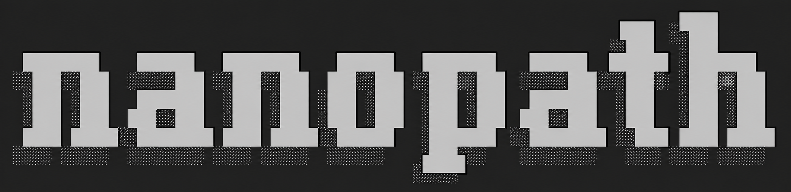
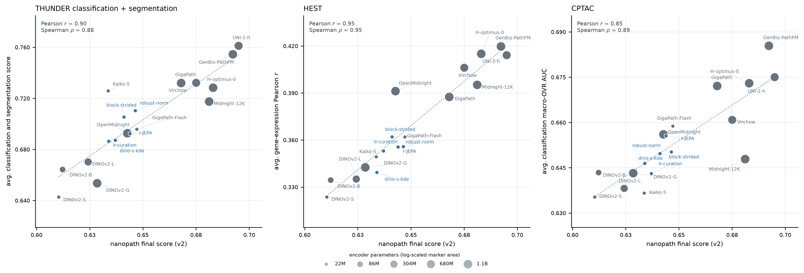

# nanopath



`nanopath` is a super lean experimental harness for training tile-level computational pathology foundation models, inspired by [nanochat](https://github.com/karpathy/nanochat). In ~1 hour it trains on 1 million pathology tiles on a single GPU and evaluates a broad suite of downstream probes spanning tile classification, segmentation, slide-level mutation/progression/survival, and robustness. The goal is to easily explore and iterate on research directions to see what works best on small-scale, then scale up the best performing training recipes with more data and larger compute.

This repository is intentionally made to be compatible with [autoresearch](https://github.com/karpathy/autoresearch)-style pursuits, and we even have a live autoresearch-style plot in [Leaderboard](#leaderboard). Nanopath models train until the next full batch would exceed the 1,000,000 tile-presentation cap or until the run reaches the 1e18-FLOP cap.

**Want to get involved? Join us in the [MedARC Discord](https://discord.gg/tVR4TWnRM9) (find us in #path-fm)!**

## Quickstart

Install [uv](https://docs.astral.sh/uv/) first if you don't have it, then:

```bash
git clone https://github.com/MedARC-AI/nanopath.git && cd nanopath
uv sync && source .venv/bin/activate
wandb login  # or: export WANDB_MODE=offline before launching noninteractive SLURM jobs

# download pretraining & probe datasets & DINOv2 pretrained ckpt
python prepare.py download=True

# smoke test: very short training, then probe evals to ensure no errors
./submit/train_1gpu.sbatch configs/smoke.yaml
# or directly on a GPU machine: python train.py configs/smoke.yaml

# train and evaluate the current nanopath recipe
# auto-submits to Labless if config passes submission requirements and you provide run name/notes & GitHub login
RUN_DIR=$PWD/data/main/my-run
./submit/train_1gpu.sbatch configs/main.yaml output_dir=$RUN_DIR
# or directly on a GPU machine: python train.py configs/main.yaml output_dir=$RUN_DIR
```

`pyproject.toml` pins `torch` / `torchvision` against the CUDA 12.9 wheel index. If your GPU/driver needs a different CUDA build, edit the `torch` and `torchvision` lines in `pyproject.toml` before `uv sync`.

A successful model training prints periodic train lines, appends metrics to `metrics.jsonl`, and writes the final comparison artifact to `summary.json`. `configs/smoke.yaml` is simply meant to pretrain briefly and then run the fixed downstream probe suite to ensure everything works without errors.

W&B can run online or offline, but set that up before submitting a noninteractive job: either run `wandb login` once, or export `WANDB_MODE=offline`.

## Leaderboard

<a href="https://labless.dev/nano-projects/nanopath">
  
</a>

`mean_probe_score`, aka `final_probe_score`, weights classification, segmentation, progression, mutation, survival, and quality-adjusted robustness at 25%, 15%, 25%, 15%, 10%, and 10%. Classification is one family even though its 12 THUNDER development tasks and linear, KNN, and 16-shot heads remain visible diagnostically. Segmentation uses PanNuke plus the two non-TCGA SegPath tasks with THUNDER's published metric; only PanNuke Fold1/Fold2 development arrays are referenced. See [benchmarking/README.md](benchmarking/README.md) for the train/validation-only protocol and PanNuke provenance caveat.
`configs/main.yaml` intentionally uses the lr-and-curation recipe. On Labless, the run labeled `leader` reflects the recipe that passed the maintainer promotion study. Table values below are individual-checkpoint scores; leader promotion is based on the three-seed mean, not the luckiest point.



### nanopath models

| # | Description | final score | classification | segmentation | progression | mutation | survival | robustness quality | Contributors |
|---|---|---:|---:|---:|---:|---:|---:|---:|---|
| 1 | [robust-norm](https://github.com/MedARC-AI/nanopath/tree/robust-norm) | **0.6733** | 0.7507 | 0.6024 | 0.6136 | 0.5885 | 0.6010 | 0.9354 | @anishdulal |
| 2 | [jepa-fino](https://github.com/MedARC-AI/nanopath/tree/jepa-fino) | 0.6698 | 0.7384 | 0.6016 | 0.5903 | 0.6190 | 0.6210 | 0.9240 | @ml-and-ml |
| 3 | [I-JEPA contig patch](https://github.com/MedARC-AI/nanopath/tree/JEPA-contig-patch) | 0.6648 | 0.7219 | 0.5993 | 0.5931 | 0.6148 | 0.6172 | 0.9225 | @NimaAsh |
| 4 | [block-strided-cls](https://github.com/MedARC-AI/nanopath/tree/block-strided-cls) | 0.6591 | 0.7477 | 0.6039 | 0.5390 | 0.6066 | 0.6335 | 0.9253 | @RyanKim17920 |
| 5 | [lr-and-curation](https://github.com/MedARC-AI/nanopath/tree/v2) | 0.6564 | 0.7048 | 0.5940 | 0.5948 | 0.6025 | 0.6199 | 0.9003 | @nevasini1 |

### Baselines

| # | Name | Description | final score | classification | segmentation | progression | mutation | survival | robustness quality |
|---|---|---|---:|---:|---:|---:|---:|---:|---:|
| 1 | UNI-2-h | MahmoodLab UNI-2-h ViT-H/14 | **0.7271** | 0.8161 | 0.6323 | 0.7156 | 0.6408 | 0.6105 | 0.9221 |
| 2 | GenBio-PathFM | GenBio-PathFM ViT-G/16 | 0.7259 | 0.8213 | 0.6100 | 0.7046 | 0.6232 | 0.6312 | 0.9628 |
| 3 | H-optimus-0 | H-optimus-0 ViT-G/14-reg | 0.7156 | 0.8082 | 0.5916 | 0.6961 | 0.6485 | 0.6059 | 0.9290 |
| 4 | Midnight-12K | Kaiko Midnight-12K ViT-G/14 | 0.7111 | 0.7761 | 0.6326 | 0.7080 | 0.6170 | 0.6100 | 0.9169 |
| 5 | [H0-mini](https://huggingface.co/bioptimus/H0-mini) | Bioptimus H0-mini ViT-B/14-reg | 0.7021 | 0.7956 | 0.6371 | 0.6586 | 0.6026 | 0.5945 | 0.9314 |
| 6 | Virchow | Paige/Microsoft Virchow ViT-H/14 | 0.7016 | 0.7728 | 0.6326 | 0.6541 | 0.6291 | 0.6173 | 0.9388 |
| 7 | GigaPath | Prov-GigaPath tile encoder ViT-G/16 | 0.6981 | 0.7948 | 0.6197 | 0.6813 | 0.6130 | 0.5802 | 0.8611 |
| 8 | GigaPath-Flash | Prov-GigaPath-Flash tile encoder ViT-S/16 | 0.6748 | 0.7742 | 0.5569 | 0.6620 | 0.5796 | 0.6122 | 0.8407 |
| 9 | OpenMidnight | OpenMidnight ViT-G/14-reg | 0.6626 | 0.6640 | 0.6306 | 0.6748 | 0.5829 | 0.6058 | 0.8534 |
| 10 | Kaiko-S/16 | Kaiko pathology ViT-S/16 | 0.6571 | 0.7737 | 0.6060 | 0.5963 | 0.5539 | 0.5907 | 0.8151 |
| 11 | DINOv2-G/14 | Meta DINOv2-G/14-reg | 0.6442 | 0.6804 | 0.5753 | 0.5928 | 0.6038 | 0.6288 | 0.8617 |
| 12 | DINOv2-L/14 | Meta DINOv2-L/14-reg | 0.6437 | 0.6632 | 0.5667 | 0.6298 | 0.6005 | 0.6009 | 0.8530 |
| 13 | DINOv2-B/14 | Meta DINOv2-B/14-reg | 0.6265 | 0.6500 | 0.5691 | 0.5753 | 0.6062 | 0.6015 | 0.8371 |
| 14 | DINOv2-S/14 | Meta DINOv2-S/14-reg | 0.6198 | 0.6480 | 0.5665 | 0.5364 | 0.6202 | 0.6220 | 0.8353 |

Across the promotion set of six nanopath models and seven principal
baselines, classification has 0.987
Pearson, 0.995 Spearman, and 0.987 all-pair concordance with official THUNDER
classification. Cross-family concordance is 1.000, and all 15 nanopath-only
pairwise orderings are identical.
For the three THUNDER segmentation tasks present in this development proxy, the
corresponding values are 0.743 and 0.782, with 0.857 cross-family concordance.
The complete four-task pinned THUNDER segmentation run, which additionally
contains prohibited all-TCGA OCELOT, has lower 0.668 Pearson but retains 0.833
cross-family concordance; the published THUNDER aggregate gives 0.719 Pearson
and 0.818 all-pair concordance. Across the 12 models with a pre-existing
official composite, the final score has 0.932 Pearson, 0.916 Spearman, 0.879
all-pair concordance, and 0.943 cross-family concordance. It never ranks a
nanopath checkpoint above GigaPath or H-optimus-0 when that
composite ranks it below the baseline.

The expanded 20-model comparison adds H0-mini, four DINOv2 sizes, Kaiko-S/16,
and GigaPath-Flash. Classification remains faithful to official THUNDER (0.988
Pearson, 0.992 Spearman, 0.979 all-pair, and 1.000 cross-family concordance).
Among the 18 models with a matched completed or same-checkpoint published
THUNDER segmentation result, segmentation has 0.850 Pearson, 0.792 Spearman,
0.848 all-pair, and 0.903 cross-family concordance. Final score has 0.941
Pearson / 0.941 Spearman with HEST and 0.851 / 0.872 with CPTAC classification
across all 20 models. These values use
the assembled fixed three-task score for every row; intermediate two-SegPath
result files are not treated as final scores. Official-suite results validate
the frozen benchmark components, and their test samples do not enter the
nanopath data or score. Exact inputs are in
[proxy-fidelity data](benchmarking/proxy_fidelity_v2.csv).

The reference scripts live in `baselines/`. H0-mini's gated weights are not
redistributed; its [runner](baselines/h0_mini_baseline.py) defaults to the
authorized snapshot at `/data/H0-mini` and accepts `checkpoint_path=/path`.

### How to submit to the leaderboard

Labless is our public run ledger and live plot for `nanopath`. You do not need a Labless password or a pull request to make a leaderboard claim; the submitter connects your submission to your GitHub identity through GitHub's device sign-in. We encourage you to submit *all* completed full runs, including null results and incremental tweaks; a dense public ledger lets you (and AI agents, see our [Agent API](https://labless.dev/docs/agent-api)) mine through everyones runs to uncover new insights.

See [labless/README.md](labless/README.md) for Labless submission details and public API usage.

`configs/main.yaml` is the current nanopath training recipe. A normal SLURM submission is:

```bash
RUN_DIR=$PWD/data/main/my-run
./submit/train_1gpu.sbatch configs/main.yaml output_dir=$RUN_DIR
```

The pipeline is:

1. Run `./submit/train_1gpu.sbatch ...` or `python train.py ...` to start your training run. For full runs, the launcher asks for a short `run_name`, notes (a description that will accompany your run on labless), and GitHub device sign-in before scheduling the GPU job. Leaving the prompts blank or failing to sign in will lead to skipping labless submission.
2. Let `train.py` finish the final probe. The run directory will contain `summary.json`, `metrics.jsonl`, and the source snapshot written at launch under `labless_source/`. The submitter writes `labless_submission.json`, checks the run caps and locked benchmark surface, posts to `api.labless.dev`, and shows the run as `unvalidated` until maintainer validation.

Manual submission is still available for direct `python train.py` runs or copied output directories:

```bash
./labless/submit_to_labless.py output_dir=$RUN_DIR run_name=kde-crops notes="what changed and why"
```

Public full-run submissions must satisfy:

- `summary.max_train_samples == 1000000`
- `summary.tile_presentations <= 1000000`
- `summary.max_train_flops == 1e18`
- final `mean_probe_score` / `final_probe_score` is present
- no saved-source changes to `probe.py` or anything under `benchmarking/`
- no locked probe config changes except local `probe.dataset_roots`

The `run_name` is the short label shown next to your dot on the Labless plot; keep it under 20 characters and make it describe what changed. Short smoke-sized runs, failed runs, and runs missing the saved source snapshot stay local. Each verified GitHub login can submit at most 100 runs per 24 hours.

A public submission is a discovery run, not by itself a promotion claim. After freezing a promising clean commit, the maintainer trains exactly three confirmation checkpoints at seeds `17`, `29`, and `43`, keeping the data split fixed. The discovery run is excluded and no confirmation seed may be dropped. Promotion requires the candidate's three-run mean to beat the incumbent's stored three-run mean by at least **0.004**. A promoted panel becomes the next stored incumbent, and its run nearest the mean is the Labless point marked validated rather than its luckiest seed. The fixed margin comes from the repeated-training audit in [benchmarking/validation.md](benchmarking/validation.md) and is not recomputed per candidate.

`train.py` and the SLURM launcher accept `seed=<int>`, and every new `summary.json` records both the training seed and fixed data-split seed. Public submissions have no wall-clock limit; each maintainer confirmation must still train on one 80 GB H100 within 2 hours. If the candidate code is pushed to nanopath `main`, Labless marks that run separately as `main`. **You don't need an H100 or a PR to submit**; Labless handles the public record and maintainer validation.

Code-cleanup PRs are still welcome when they simplify the codebase without changing benchmark performance on the main recipe. Leaderboard claims should go through labless instead of a pull request.

### What you must NOT change for a leaderboard submission

Anything not explicitly fixed below (e.g., model architecture, training objective, optimizer, lr scheduler, data augmentations, masking, dataset curation) is fair game for modification.

**Training ends at 1,000,000 tile-presentation samples OR 1e18 total FLOPs**

Every leaderboard run is bounded by two possible caps:

- **`train.max_train_samples` ≤ 1,000,000 tile presentations**. A training sample is one source TCGA tile emitted as one dataloader item; if the same underlying tile is seen again later, that is another tile presentation. Teacher/student views, global/local crops, masks, or other augmentations derived from that tile do not multiply the sample count, though their compute still counts toward FLOPs. `train.py` never starts a batch that would push `summary.tile_presentations` over the cap.
- **`train.max_train_flops` ≤ 1e18 training FLOPs**, measured directly via `torch.utils.flop_counter.FlopCounterMode` on the first step (forward + backward + optimizer.step) and reused thereafter since per-step shapes are fixed. This counts everything that touches the GPU during a step (student backbone, EMA teacher forward, projection heads, masking, etc.).

LR decay, weight decay, teacher-temperature, freeze, and KDE schedules are keyed to `train_flops / train.max_train_flops`; LR warmup is keyed to tile presentations so it finishes early in the 1,000,000-tile sample-capped run. With the current small model and augmentations, `configs/main.yaml` normally reaches the sample cap at about 19% of the 1e18-FLOP budget, so the FLOP-keyed schedules intentionally stop early unless you change the caps or schedule fractions.

Wall time is logged for diagnostics and standardized reruns, but it is not a public-submission eligibility cap. Maintainer validation is separate: the submitted recipe must complete training on the maintainer's single 80 GB H100 within 2 hours.
Intensive preprocessing before model training starts, such as tile extraction, data curation, metadata joins, indexing, or embedding generation, is allowed and is not counted as training time.

**TCGA as the only tile source**
- Every image tile used for training must be produced exclusively from the 12K TCGA WSIs. You can change tile extraction, filtering, sampling, curation, and preprocessing before the capped model-training run begins.
- Public non-tile information is fair game: metadata, clinical/genomic labels, text, ontologies, annotations, or other non-image-tile signals from any public source may be used however you want.

**Probe evaluation must be untouched**
- All of `probe.py` and `benchmarking/` (note this means you *can* modify model.py however you wish!)
- All probe config variables in `configs/main.yaml`.

**Pretraining must not use pathology-specific pretrained models**
Non-pathology pretrained models such as DINOv2 may be used for initialization, teachers, data curation, or preprocessing. Pathology-trained checkpoints such as H-optimus-0 or OpenMidnight may not initialize weights or guide training, but they may be used before and separately from training for TCGA-tile curation or preprocessing.

### Labless for live tracking

Full training runs auto-submit to the labless live tracker if certain criteria are met (see [How to submit to the leaderboard](#how-to-submit-to-the-leaderboard)).

The script reads `summary.json` and `metrics.jsonl`, reviews `output_dir/labless_source` rather than your current working tree, and posts the local payload in `labless_submission.json` after GitHub device sign-in succeeds. W&B can be online or offline; online runs add a public W&B link, while source review always comes from the local snapshot. `AGENTS.md` and `CLAUDE.md` are excluded from Labless source packaging. The labless website, run log, and plot update automatically.

## Repository layout

### Primary files meant to be hacked
- `train.py` — main pretraining loop
- `model.py` — model architecture and training objectives
- `dataloader.py` — TCGA tile loader and data augmentations
- `configs/{smoke,main}.yaml` — training recipes (e.g., hyperparameters)

### Helper files
- `AGENTS.md` — guidelines for design philosophy, coding rules, experiment discipline, cluster conventions, etc. Note this is Paul's personal `AGENTS.md` file and has instructions specific to our MedARC cluster—you should modify this file to suit your own setup!
- `benchmarking/` — locked manifests, dataset/protocol documentation, null audit, and proxy-fidelity evidence.
- `prepare.py` — data prep: verify or download pretraining data + probe datasets + any pretrained weights.
- `probe.py` — downstream probes (KNN, few-shot, linear, segmentation, slide AUROC, survival, robustness).
- `submit/train_1gpu.sbatch` — SLURM launcher for single-GPU training.
- `labless/submit_to_labless.py` — package a run and post it to the live labless tracker.
- `download_TCGA.sh` — manual utility, run by hand if you want the full 12K TCGA open-access SVS slide set (~13 TB) for forking the tile-extraction recipe. Not invoked by `prepare.py` and not needed for any standard training workflow.
- `pyproject.toml` + `uv.lock` — Python dependencies used by `uv sync`.

## Data

`prepare.py` prepares the necessary data for pretraining and downstream probing. By default it reads `configs/main.yaml`; pass a YAML path before the flag to prepare a different config, e.g. `python prepare.py configs/smoke.yaml download=True`. Flag `download=True` to fetch/prepare the configured datasets into the folders specified by the YAML; flag `download=False` to verify that all required paths are already populated.

On the MedARC cluster, the checked-in `/data` paths are the intended shared defaults and existing populated roots are reused. On a machine without writable `/data` or `/block` mounts, `download=True` rewrites the checked-in main and smoke configs to ignored repo-local `data/` roots before downloading.

**What `download=True` does**
1. **TCGA tiles**: `huggingface_hub.snapshot_download` (filtered to `shard-*.parquet`) pulls the 200 parquet shards (~120 GB total, `{path: string, jpeg: binary}` rows with 64-row row groups) from [`medarc/nanopath`](https://huggingface.co/datasets/medarc/nanopath) into `data.dataset_dir`.
2. **Probe datasets**: downloads the exact evaluation snapshot from [`medarc/nanopath-evals`](https://huggingface.co/datasets/medarc/nanopath-evals) into each missing configured root, then verifies every required record. The snapshot is pinned to an immutable Hub revision in `prepare.py`; interrupted Hub downloads are resumable.
3. **DINOv2 backbone weights**: `torch.hub.load_state_dict_from_url` fetches the Meta checkpoint for `model.type` from `dl.fbaipublicfiles.com` into `~/.cache/torch/hub/checkpoints/`.

**Prerequisites**
- About 355 GB free for a fresh complete setup: ~120 GB of pretraining shards, ~215 GB of extracted probe data, and temporary room while the largest image archive is extracted. Existing populated roots reduce the download and space requirement.
- Acceptance of each upstream benchmark dataset's original research-use terms. The MedARC mirror preserves the data needed by the protocol but does not relicense its components.

The evaluation mirror contains only manifest-selected development data. It contains no official THUNDER, HEST, or CPTAC classification test records; HEST is absent entirely, CPTAC appears only in the existing CPTAC-PDA survival development probe, PanNuke Fold3 is absent, and the unused TCGA center is removed from downloadable Tolkach ESCA. ESCA's probe-training subset retains selected TCGA images, but its entire scored validation subset is UKK. See [benchmarking/README.md](benchmarking/README.md) for the precise split contract.

### Regenerating the tile dataset from raw SVS

`prepare.py` itself never touches raw SVS files—it always pulls the ready-made parquet shards from HF. If you want, however, you can download the full ~13 TB original SVS files from TCGA and pre-extract different tiles to pretrain on. Two-step workflow (decode SVS → JPEG dir + manifest, then pack into parquet shards):

```bash
# 1) Download the full 12K open-access TCGA SVS slide set (~13 TB).
bash download_TCGA.sh /data/TCGA 8

# 2) Decode + pack. prepare_tiles deterministically subsamples the sample list
#    to TARGET_TILE_COUNT (4M, hardcoded in prepare.py — bump it for a bigger
#    dataset) and writes JPEGs + manifest.txt under jpeg_dir; reruns are
#    resumable (existing JPEGs are EOF-validated and reused). pack_from_jpeg_dir
#    then walks the manifest, splits into NUM_SHARDS=200 chunks, and writes
#    shard-NNNNN.parquet files with 64-row row groups (the layout the
#    dataloader expects). Once it's done you can rm -rf the jpeg_dir.
python -c "
from pathlib import Path
from prepare import prepare_tiles, pack_from_jpeg_dir
jpeg_dir = Path('/data/$USER/nanopath/nanopath_jpegs_tmp')
prepare_tiles(Path('/data/TCGA/sample_dataset_30.txt'), jpeg_dir, split_seed=42)
pack_from_jpeg_dir(jpeg_dir, jpeg_dir / 'manifest.txt', Path('/data/$USER/nanopath/nanopath_parquet'))
"
```

Point `data.dataset_dir` at the packed parquet directory before training. To publish a new variant of the training dataset, push the resulting shards to a fresh HF dataset repo and update `HF_TRAIN_REPO_ID` in `prepare.py`.

## Running

Smoke (short training + full probe):

```bash
./submit/train_1gpu.sbatch configs/smoke.yaml
# or directly on a GPU machine: `python train.py configs/smoke.yaml`
```

Full main `nanopath` recipe:

```bash
./submit/train_1gpu.sbatch configs/main.yaml
# or directly on a GPU machine: `python train.py configs/main.yaml`
```

`submit/train_1gpu.sbatch` is a prompt-aware launcher when run directly: it collects Labless run name, notes, and GitHub device login before submitting itself to SLURM, then auto-submits eligible completed full runs. Calling `sbatch submit/train_1gpu.sbatch ...` bypasses that prompt and trains without auto-submit. `configs/main.yaml` is sized for an 80 GB H100 at `train.batch_size: 128`. On smaller cards you can set `train.activation_checkpointing: true` and lower `train.batch_size` if you OOM.

The checked-in `#SBATCH --partition=n`, `--account=sophont`, and `--qos=high` lines are MedARC-specific. On another SLURM cluster, edit those header lines once to match your queue, or run `python train.py ...` directly on an allocated GPU.

## Outputs

`prepare.py … download=True` keeps populated or writable shared roots and localizes missing roots only when the configured shared mount is unavailable.

- run outputs: `project.output_dir` (MedARC cluster default `/data/$USER/nanopath/main/...`; auto-localized default `nanopath/data/main/...`). Final probe results log to `metrics.jsonl`.
- wandb: `project.wandb_dir` (cluster default `/data/$USER/nanopath/wandb`; auto-localized default `nanopath/data/wandb`).
- parquet tile shards: `data.dataset_dir` (defaults to `/data/nanopath_parquet`).
- probe datasets: canonical shared `/data/thunder-data`, `/data/surgen`, `/data/leopard_bcr`, `/data/CPTAC-PDA`, `/data/pathorob`, and `/data/ucla-lung` roots declared in `probe.dataset_roots`.
- DINOv2 backbone weights: `~/.cache/torch/hub/checkpoints/` for the selected `model.type`.
- SLURM logs: `slurm/<jobid>.{out,err}` in the repo.
- labless source snapshot: `project.output_dir/labless_source`.
- labless submission payload: `project.output_dir/labless_submission.json`.
- labless auto-submit token: `${project.output_dir}.labless_autosubmit.json` while a prompt-armed SLURM job is running; the launcher removes it after the post-run submission attempt.
- checkpoints: rolling `latest.pt` written every `train.save_every` steps under `project.output_dir`, plus one final save at end of run. `save_every: null` (smoke) disables both; probes always get their own short-lived checkpoint regardless.

## Experiment log

See the live [labless nanopath log](https://labless.dev/nano-projects/nanopath) for submitted completed runs.

## Acknowledgements

Inspired by [nanochat](https://github.com/karpathy/nanochat). The DINOv2 backbone weights are [Meta checkpoints](https://github.com/facebookresearch/dinov2) loaded by state-dict into our own clean ViT implementation. Tile-classification and segmentation probes follow the [THUNDER benchmark](https://mics-lab.github.io/thunder/); slide-level probes follow [PathoBench](https://huggingface.co/datasets/MahmoodLab/Patho-Bench) and LEOPARD.
